# 🏗️ Diagramas de Arquitectura - ITSM SaaS Platform

## Arquitectura de Alto Nivel

```mermaid
graph TB
    subgraph "Cliente"
        U[👤 Usuario]
        B[🌐 Navegador Web]
    end

    subgraph "Frontend Layer"
        A[⚡ Angular App<br/>Puerto 4200]
        R[🔄 Router]
        C[🧩 Componentes]
        S[🔧 Servicios]
    end

    subgraph "Backend Layer"
        D[🐍 Django API<br/>Puerto 8000]
        DRF[📡 Django REST Framework]
        JWT[🔐 JWT Auth]
        V[📋 ViewSets]
    end

    subgraph "Database Layer"
        PG[(🐘 PostgreSQL<br/>Puerto 5432)]
        RD[(🔴 Redis<br/>Puerto 6379)]
    end

    subgraph "Container Layer"
        DC[🐳 Docker Compose]
        C1[📦 Frontend Container]
        C2[📦 Backend Container]
        C3[📦 Database Container]
        C4[📦 Redis Container]
    end

    U --> B
    B --> A
    A --> R
    R --> C
    C --> S
    S --> D
    D --> DRF
    DRF --> JWT
    DRF --> V
    V --> PG
    D --> RD

    DC --> C1
    DC --> C2
    DC --> C3
    DC --> C4

    A -.-> C1
    D -.-> C2
    PG -.-> C3
    RD -.-> C4
```

## Flujo de Datos

```mermaid
sequenceDiagram
    participant U as 👤 Usuario
    participant F as ⚡ Frontend
    participant A as 🔐 Auth API
    participant T as 🎫 Tickets API
    participant DB as 🐘 Database

    U->>F: 1. Accede a la aplicación
    F->>A: 2. POST /api/token/ (login)
    A->>DB: 3. Validar credenciales
    DB-->>A: 4. Usuario válido
    A-->>F: 5. JWT Token
    F->>F: 6. Almacenar token

    U->>F: 7. Crear nuevo ticket
    F->>T: 8. POST /api/tickets/ + JWT
    T->>T: 9. Validar token
    T->>DB: 10. Crear ticket
    DB-->>T: 11. Ticket creado
    T-->>F: 12. Respuesta exitosa
    F-->>U: 13. Confirmación
```

## Modelo de Datos Relacional

## Arquitectura Frontend (Angular)

```mermaid
graph TD
    subgraph "Angular Application"
        subgraph "Core"
            AM[📱 App Module]
            AR[🛣️ App Routing]
            AC[🎯 App Component]
        end

        subgraph "Feature Modules"
            AUTH[🔐 Auth Module]
            DASH[📊 Dashboard Module]
            TICK[🎫 Tickets Module]
            ASSET[💻 Assets Module]
        end

        subgraph "Shared Services"
            API[🔌 API Service]
            TSERV[🎫 Ticket Service]
            USERV[👤 User Service]
            ORGSERV[🏢 Org Service]
            ASSETV[💻 Asset Service]
        end

        subgraph "Components"
            LOGIN[🔑 Login]
            DASHC[📊 Dashboard]
            TCREATE[➕ Ticket Create]
            TLIST[📋 Ticket List]
            TVIEW[👁️ Ticket View]
        end

        subgraph "Guards & Interceptors"
            GUARD[🛡️ Auth Guard]
            INT[🔄 HTTP Interceptor]
        end
    end

    AM --> AR
    AM --> AC
    AM --> AUTH
    AM --> DASH
    AM --> TICK

    AUTH --> LOGIN
    DASH --> DASHC
    TICK --> TCREATE
    TICK --> TLIST
    TICK --> TVIEW

    TCREATE --> TSERV
    TLIST --> TSERV
    DASHC --> TSERV

    TSERV --> API
    USERV --> API
    ORGSERV --> API
    ASSETV --> API

    AR --> GUARD
    API --> INT
```

## Arquitectura Backend (Django)

```mermaid
graph TD
    subgraph "Django Application"
        subgraph "Core"
            SETT[⚙️ Settings]
            URLS[🛣️ URLs]
            WSGI[🌐 WSGI]
        end

        subgraph "Apps"
            ORG[🏢 Organizations]
            TICK[🎫 Tickets]
            ASSET[💻 Assets]
            USER[👤 Users]
        end

        subgraph "API Layer"
            DRF[📡 Django REST Framework]
            VIEW[📋 ViewSets]
            SERIAL[🔄 Serializers]
            PERM[🔐 Permissions]
        end

        subgraph "Authentication"
            JWT[🔑 JWT Simple]
            AUTH[🛡️ Auth Backends]
        end

        subgraph "Database"
            MODELS[🗃️ Models]
            MIGR[🔄 Migrations]
            ADMIN[⚙️ Admin]
        end

        subgraph "External Services"
            SWAGGER[📖 Swagger/OpenAPI]
            CORS[🌐 CORS Headers]
        end
    end

    SETT --> URLS
    URLS --> ORG
    URLS --> TICK
    URLS --> ASSET
    URLS --> USER

    ORG --> VIEW
    TICK --> VIEW
    ASSET --> VIEW
    USER --> VIEW

    VIEW --> SERIAL
    VIEW --> PERM
    SERIAL --> MODELS

    DRF --> VIEW
    DRF --> JWT
    JWT --> AUTH

    MODELS --> MIGR
    MODELS --> ADMIN

    DRF --> SWAGGER
    DRF --> CORS
```

## Flujo de Autenticación

```mermaid
graph LR
    subgraph "Cliente"
        U[👤 Usuario]
    end

    subgraph "Frontend"
        L[🔑 Login Form]
        S[🔧 Auth Service]
        G[🛡️ Auth Guard]
    end

    subgraph "Backend"
        A[🔐 Auth Endpoint]
        J[🎫 JWT Service]
        D[🗃️ Database]
    end

    U -->|1. Credenciales| L
    L -->|2. Login request| S
    S -->|3. POST /api/token/| A
    A -->|4. Validar usuario| D
    D -->|5. Usuario válido| A
    A -->|6. Generar tokens| J
    J -->|7. Access + Refresh tokens| A
    A -->|8. Respuesta JWT| S
    S -->|9. Almacenar tokens| S
    S -->|10. Redireccionar| G
    G -->|11. Dashboard| U
```

---

_Diagramas creados: Octubre 2025_
