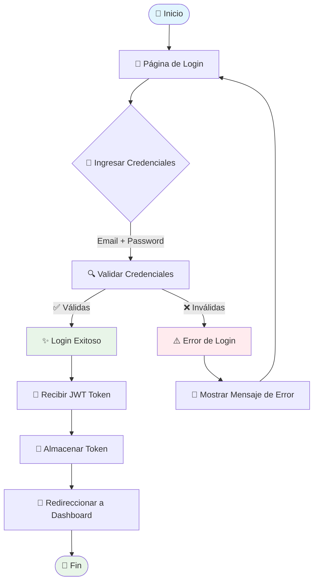
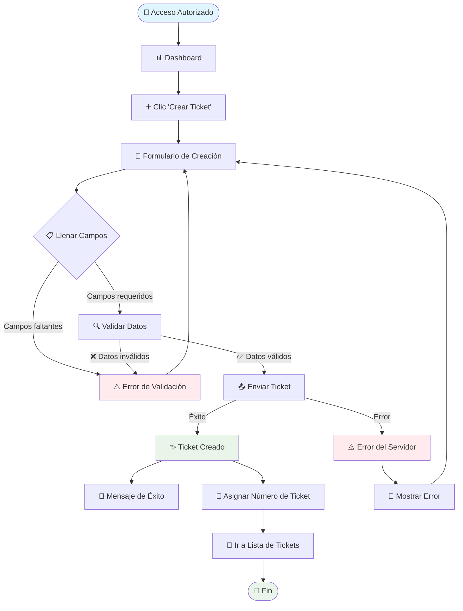
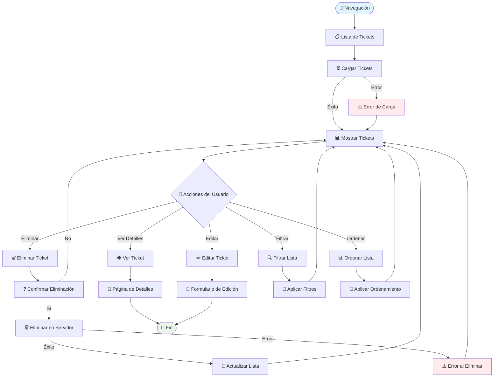
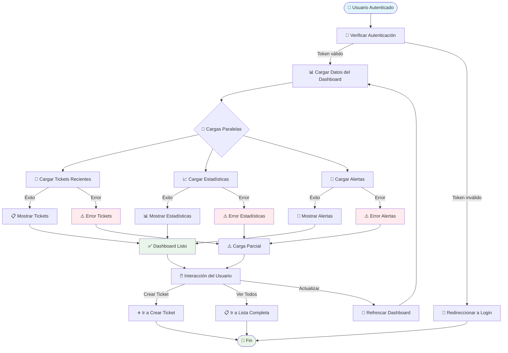
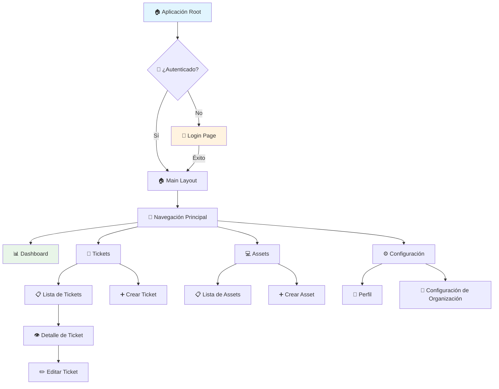
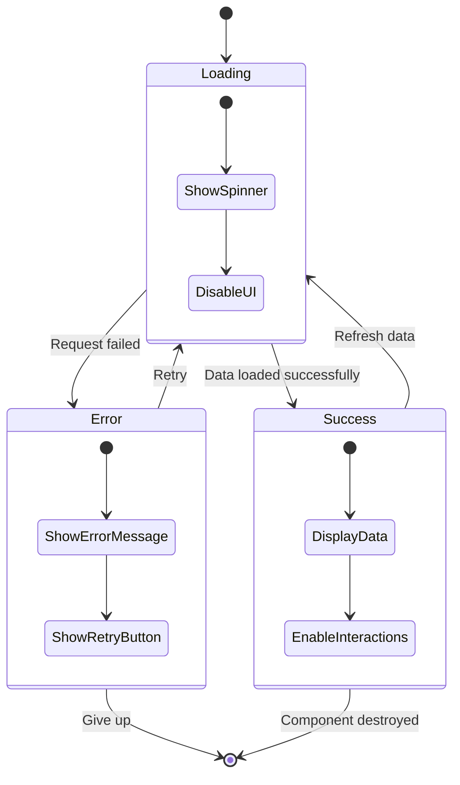

# 🔄 Flujos de Usuario - ITSM SaaS Platform

## 1. Flujo de Registro y Login

### Login de Usuario

### Estados del Login

- **Inicial**: Formulario vacío esperando credenciales
- **Validando**: Enviando petición al backend
- **Error**: Credenciales incorrectas o error de conexión
- **Éxito**: Autenticación exitosa, redirigiendo

## 2. Flujo de Gestión de Tickets

### Creación de Ticket

### Campos del Formulario de Ticket

1. **Título** (requerido)

   - Descripción breve del problema
   - Mínimo 5 caracteres

2. **Descripción** (requerido)

   - Detalle completo del problema
   - Mínimo 10 caracteres

3. **Tipo de Ticket**

   - Incidente
   - Solicitud de Servicio
   - Cambio
   - Problema

4. **Prioridad**

   - Baja
   - Media
   - Alta
   - Crítica

5. **Categoría** (opcional)

   - Hardware
   - Software
   - Red
   - Acceso
   - Otros

6. **Fecha Límite** (opcional)
   - No puede ser anterior a hoy

### Lista de Tickets

## 3. Flujo de Dashboard

### Carga del Dashboard

### Widgets del Dashboard

1. **Estadísticas Rápidas**

   - Total de tickets
   - Tickets abiertos
   - Tickets asignados a mí
   - Tickets vencidos

2. **Tickets Recientes**

   - Últimos 5 tickets creados
   - Estado y prioridad
   - Enlaces rápidos

3. **Alertas del Sistema**
   - Tickets críticos
   - SLA próximos a vencer
   - Notificaciones importantes

## 4. Flujo de Navegación

### Estructura de Navegación

## 5. Estados de Carga y Error

### Manejo de Estados

### Tipos de Errores

1. **Errores de Red**

   - Sin conexión a internet
   - Servidor no disponible
   - Timeout de conexión

2. **Errores de Autenticación**

   - Token expirado
   - Credenciales inválidas
   - Permisos insuficientes

3. **Errores de Validación**

   - Campos requeridos vacíos
   - Formato de datos incorrecto
   - Valores fuera de rango

4. **Errores del Servidor**
   - Error interno del servidor (500)
   - Recurso no encontrado (404)
   - Conflicto de datos (409)

---

_Documentación de flujos: Octubre 2025_
